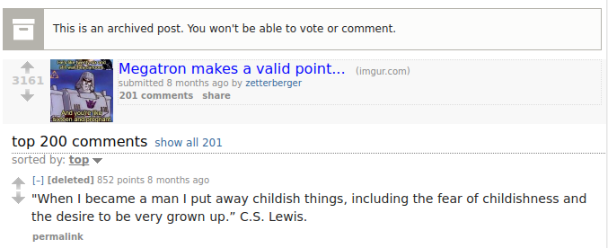
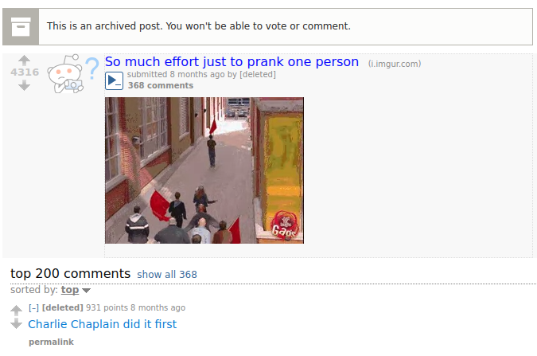
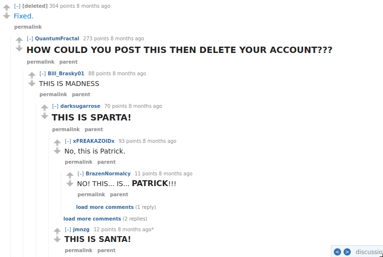
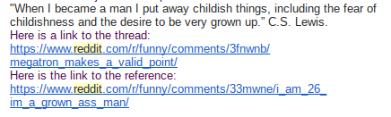

#IRedditBefore
Automated commenting on <a href="https://www.reddit.com" alt="Reddit">Reddit</a> reposted threads using <a href="http://karmadecay.com/" alt="Karma Decay">Karma Decay</a>. The bot process works as follows:  
<ol>
<li> Looks for risinng reposted links on Reddit (<a href="https://www.reddit.com/r/funny/" alt="r/funny">r/funny</a>) </li>
<li> Aquires all source/reposted threads of that submission </li>
<li> Takes the top thread and copys the top comment </li>
<li> Posts comment on current reposted thread </li>
<li> Sends user an email about the comment </li>
</ol>
###Example 1

###Example 2

###Example 3 - Just after I deleted the bot

##Why???
THis was primarily an experimental project. I wanted to see how Reddit would react to reposted comments. The bot recieved 25k comment karma in 3 days. After 3 days I deleted the bot. 

##Email Example

##Working with Karma Decay
I used kdapi as the base for my Karma Decay script. I fixed many issues with the webpage parsing. Karma Decay also blocked many US AWS ips, so I used a proxy.

##Resources Used
- <a href="https://github.com/ethanhjennings/karmadecay-api" alt="kdapi">kdapi</a>
- <a href="https://github.com/SmBe19/praw-OAuth2Util" alt="praw-OAuth2Util">praw-OAuth2Util</a>
- <a href="https://www.openshift.com/" alt="openshift">openshift</a>

  
